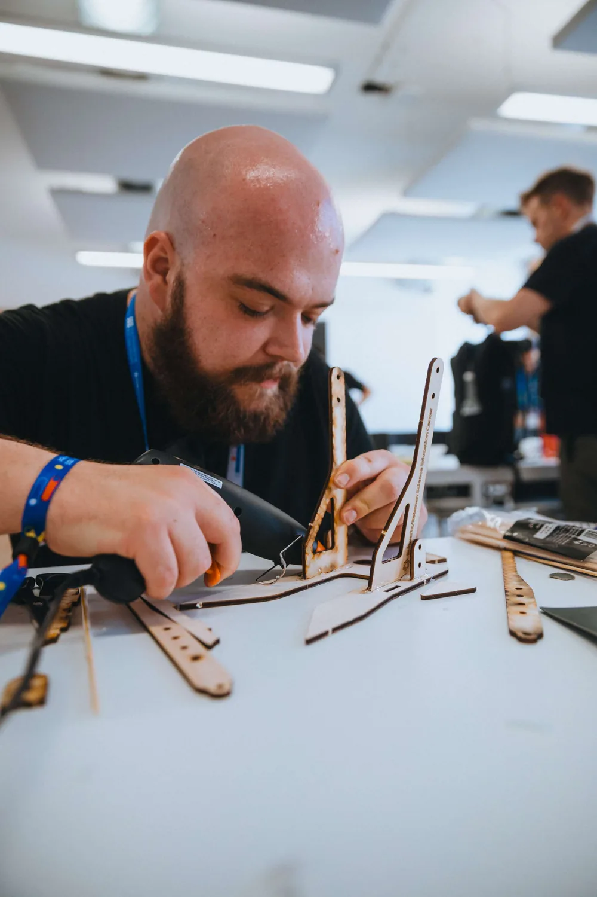
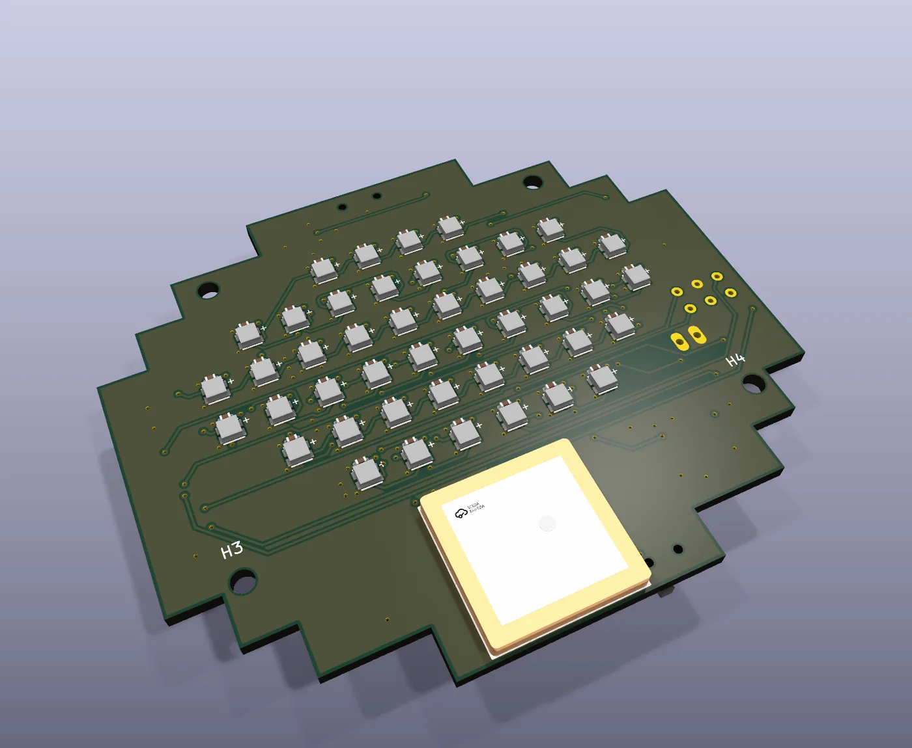
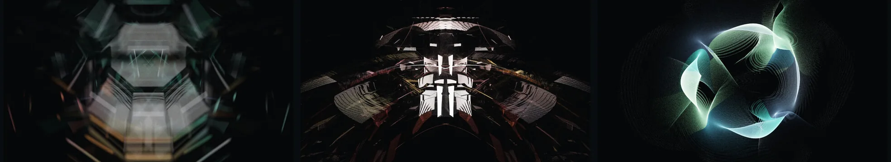
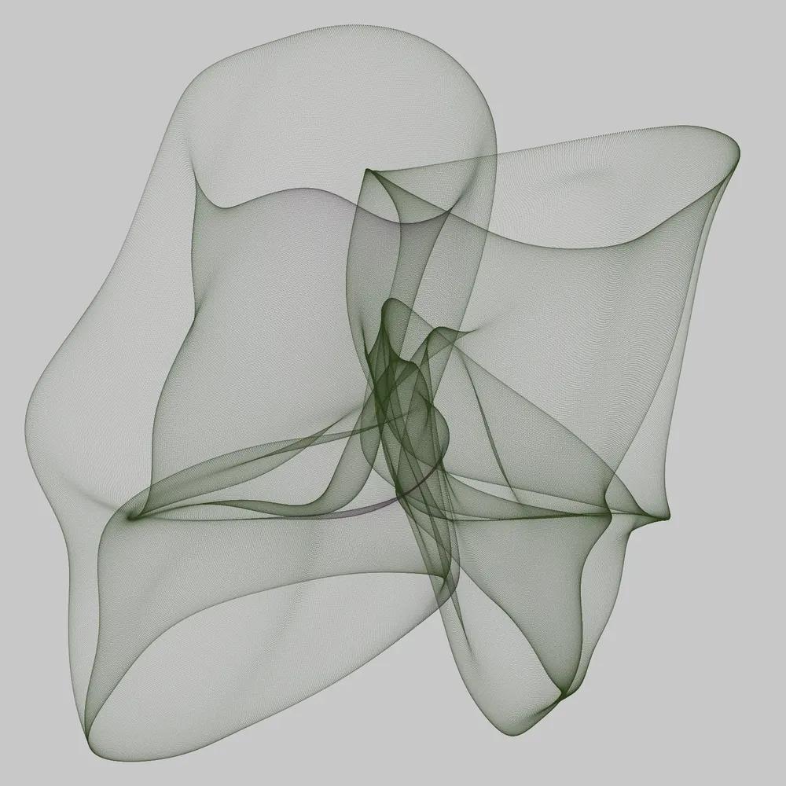

# I design, build and teach.

I'm Magnús Pétursson, a maker and educator in Reykjavík. I teach digital fabrication and product and microelectronics design, and in between I build my own hardware and software.

[See my projects](projects/index.md){ .md-button .md-button--primary }
[About me](about.md){ .md-button }

<figure class="mp-hero__photo">
  
</figure>

## Selected work

<figure>
  
</figure>

### McCompass

A pocket-sized, real-life Minecraft compass, built with a friend. The needle is 46 LEDs behind a 5 mm pixel grid, and it points at a saved spot or at its twin over LoRa radio, with no phone, SIM card or Wi‑Fi.

KiCad, FreeCAD, ESP32-S3, GNSS, LoRa, 4-colour FDM printing

[Read about McCompass](projects/mccompass.md)

<figure>
  
</figure>

### GlassLight

A generative art studio that traces light through invisible procedural glass and paints only the caustics that reach the wall. Every composition can be reproduced from its seed.

C++20, Vulkan, SDL 3, Windows and Linux

[Read about GlassLight](projects/glasslight.md)

<figure>
  
</figure>

### PFB Studio

A native Windows and Linux app that runs the PerlinFieldBot generative art generators locally and draws them live.

C++17, SFML, Dear ImGui, CMake

[Read about PFB Studio](projects/pfb-studio.md)

