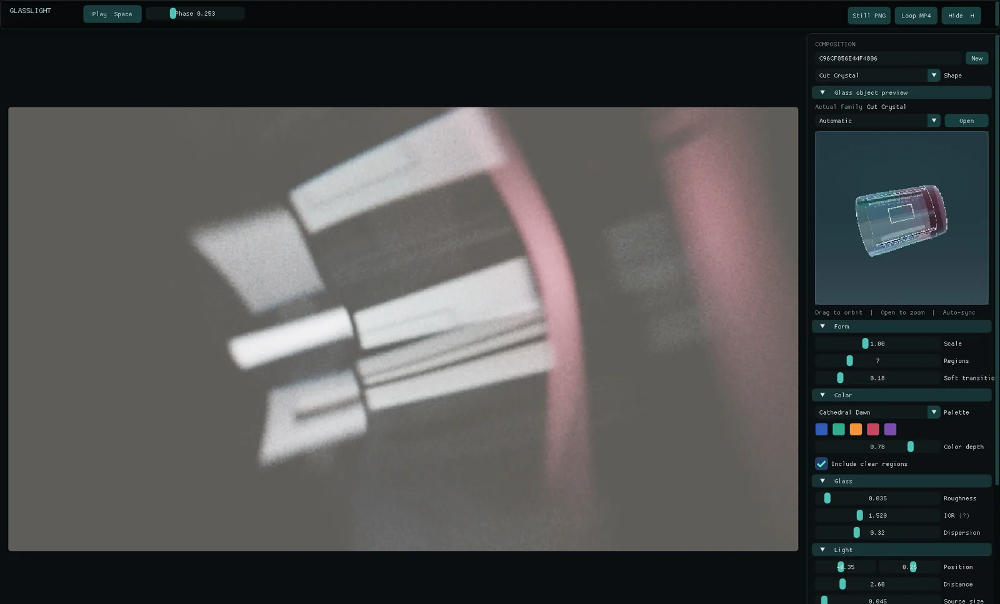
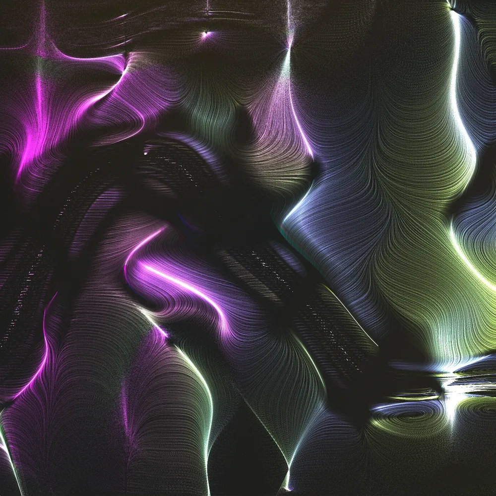

# Projects

Things I've designed and built: hardware and software. Each page covers what it is, how it works and where it stands.

<figure>
  
</figure>

### McCompass

A pocket-sized, real-life Minecraft compass that points at a saved spot or at its twin over LoRa radio.

Hardware, in progress

[Read about McCompass](mccompass.md)

<figure>
  
</figure>

### GlassLight

A generative art studio that shapes light through invisible procedural glass.

Software, released

[Read about GlassLight](glasslight.md)

<figure>
  
</figure>

### PFB Studio

A native studio app that runs the PerlinFieldBot generators live on your own machine.

Software, released

[Read about PFB Studio](pfb-studio.md)

